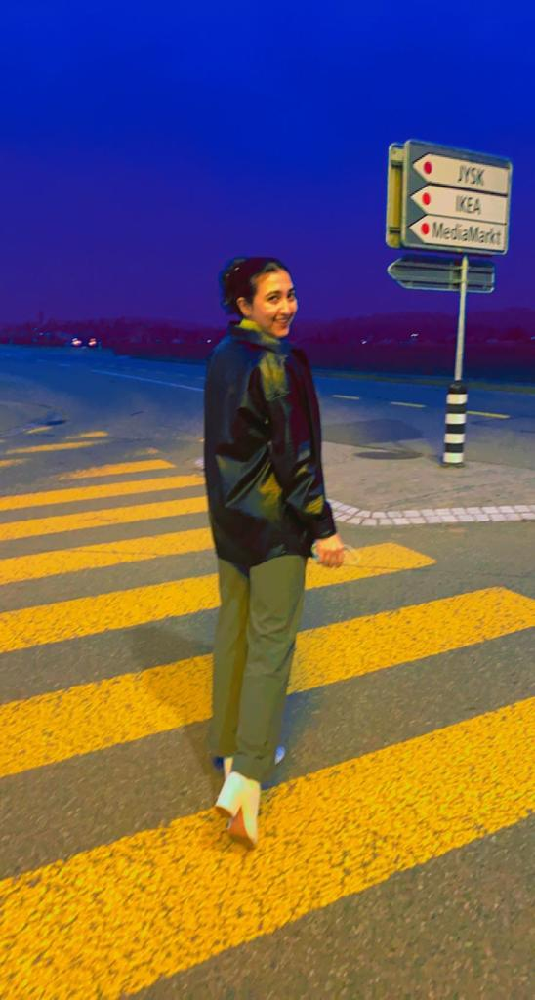

+++
title = "Das Leben, als geflüchtete Person, in der Schweiz. "
date = "2023-04-07"
draft = false
pinned = false
+++
## Ein Interview mit Morsal (22) über ihre Flucht und ihr Leben als geflüchtete Person in der Schweiz. Sie berichtet von den Schwierigkeiten, die sowohl während ihrer Flucht als auch im Leben als Geflüchtete in der Schweiz auftreten, insbesondere in Bezug auf Identitätsfragen.

